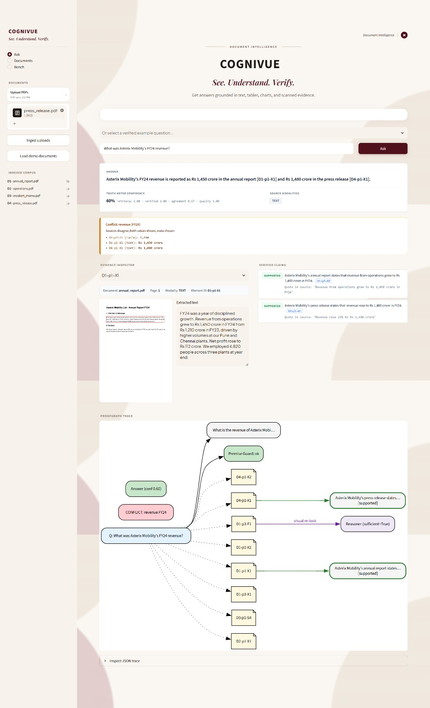
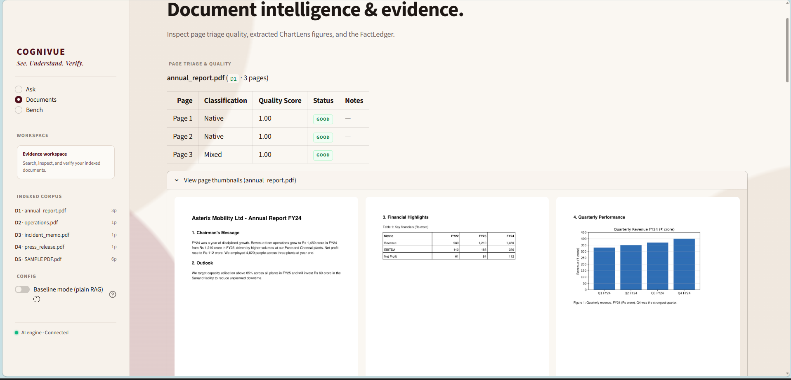
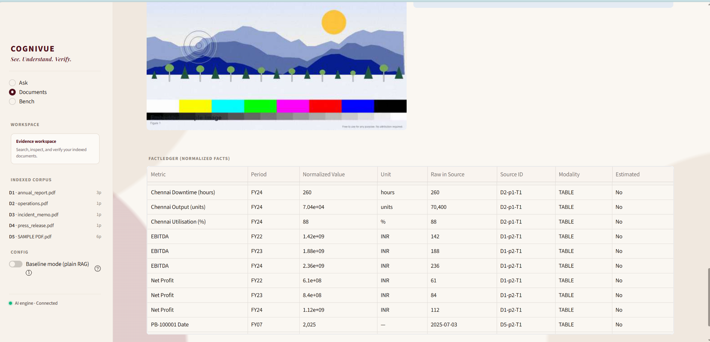

# COGNIVUE
### Evidence-Locked Multimodal Document Intelligence
**See. Understand. Verify.**

Real-world documents are not text-only. Important information may be distributed across paragraphs, tables, charts, embedded images, scanned pages, and multiple files. COGNIVUE is a Streamlit application that processes these mixed PDFs, retrieves traceable evidence, performs calculations outside the language model, and verifies generated claims before presenting an answer.

> Other systems give an answer and a page number.
> COGNIVUE gives a ledger of facts, a receipt for important numbers, and an honest confidence signal.

## Problem

Standard PDF chat systems often flatten a document into text and then ask an LLM to answer from that text. This can miss table structure, chart values, scan quality, page context, and contradictions between documents. It can also make arithmetic and unsupported claims difficult to audit.

COGNIVUE treats a document as a collection of identifiable evidence elements. Answers are assembled from retrieved text, tables, visual evidence, page metadata, and stored facts. When the evidence does not support an answer, the system is designed to refuse rather than invent one.

## Why COGNIVUE Is Different

COGNIVUE is built around three principles:

### 1. Every important number has a receipt

Numbers used in an answer can be traced to their source evidence and, when calculated, to the exact formula and inputs used.

### 2. Conflicting evidence is surfaced, not hidden

If two documents disagree, COGNIVUE does not silently choose one. It exposes the disagreement and shows both sources.

### 3. Unsupported questions can be refused

If the available evidence is insufficient, COGNIVUE can return a grounded refusal instead of producing a plausible-looking answer.

This makes the system **evidence-locked rather than answer-first**.

## Core Innovation

COGNIVUE separates **evidence collection**, **reasoning**, **calculation**, and **verification**:

1. Extract document elements and preserve their source locations.
2. Store normalized facts and searchable evidence.
3. Retrieve evidence with both semantic and exact-term search.
4. Ask Gemini to reason over a bounded multimodal evidence pack.
5. Execute permitted arithmetic in Python.
6. Verify claims, numbers, quotes, and evidence references.
7. Surface confidence, conflicts, receipts, and grounded refusals in the UI.

The goal is not to make AI sound confident. The goal is to make AI show its work.

## Feature Status

| Capability | Status | What is available |
|---|---|---|
| Multimodal PDF ingestion | ✅ Implemented | Native text, tables, figures, and scanned-page handling |
| Stable evidence elements | ✅ Implemented | Document, page, element, modality, source path, and quality metadata |
| Document triage | ✅ Implemented | Native, mixed, and scanned page classification with quality signals |
| OCR processing | ✅ Implemented | OpenCV preprocessing and RapidOCR for scan content |
| ChartLens visual extraction | ✅ Implemented | Gemini-assisted chart analysis with extracted visual metadata |
| FactLedger | ✅ Implemented | SQLite storage for normalized facts from text and tables |
| Hybrid retrieval | ✅ Implemented | FastEmbed/ChromaDB, BM25, and reciprocal-rank fusion |
| Cross-document evidence packs | ✅ Implemented | Retrieval preserves source and page context across documents |
| Question planning | ✅ Implemented | Complex questions are decomposed into retrieval sub-questions |
| Multimodal reasoning | ✅ Implemented | Gemini receives retrieved text and relevant visual evidence |
| Numbers with Receipts | ✅ Implemented | Python calculations with inputs, formulas, results, and source IDs |
| Claim verification | ✅ Implemented | Evidence IDs, quotes, numbers, and entailment checks |
| Truth Meter signals | ✅ Implemented | Confidence, verification, conflict, and support information |
| Conflict detection | ✅ Implemented | Disagreement between relevant evidence is surfaced |
| Premise Guard | ✅ Implemented | False or inconsistent premises are challenged |
| Grounded refusal | ✅ Implemented | Unsupported questions receive an evidence-based refusal |
| Evidence viewer | ✅ Implemented | Documents, pages, extracted elements, and facts can be inspected |
| ProofGraph | ✅ Implemented | UI trace of question, evidence, calculations, and answer |
| Benchmark and baseline mode | ✅ Implemented | Labelled questions can run in full and baseline modes |
| Chart/text cross-checking | 🔮 Planned / Stretch | A future comparison layer for independent modality disagreement |

## Architecture

```text
PDF uploads
    │
    ▼
Page processing and document triage
    │
    ├── Native text and layout blocks
    ├── Tables
    ├── Figures and charts
    └── Scanned-page rendering and OCR
    │
    ▼
Element Store + FactLedger (SQLite)
    │
    ▼
Dense retrieval (FastEmbed + ChromaDB)
        + BM25 keyword retrieval
        + Reciprocal Rank Fusion
    │
    ▼
Question planner
    │
    ▼
Multimodal evidence pack
    │
    ▼
Gemini structured reasoning
    │
    ├── Python calculation engine
    ├── Claim verification
    ├── Conflict analysis
    └── Confidence and refusal gates
    │
    ▼
Answer, citations, receipts, evidence viewer, and ProofGraph
```

## End-to-End Workflow

### 1. Upload and ingest

PDFs uploaded from the Ask view are saved under `data/uploads/`. Selecting a file stages it; **Ingest uploads** runs the existing processing pipeline and adds the document to the local store.

### 2. Process each page

PyMuPDF extracts native page text, blocks, images, and metadata. pdfplumber is used for table extraction. Pages are triaged as native, mixed, or scanned, and quality information is retained for later inspection and confidence reporting.

### 3. Extract multimodal evidence

Scanned pages are rendered and processed with OpenCV and RapidOCR. Figures and charts can be sent to Gemini through ChartLens for structured visual extraction. Visual values are treated as estimated when the source does not provide exact data.

### 4. Store traceable elements and facts

Every stored element retains source identity and location, such as a document ID, page number, element ID, modality, text or structured data, image path where applicable, and quality metadata. Important numeric facts are persisted in the SQLite FactLedger.

### 5. Retrieve an evidence pack

The index combines dense semantic retrieval with BM25 keyword retrieval. Reciprocal-rank fusion combines the result lists while preserving document, page, section, element, and modality metadata. BM25 helps with exact names, numbers, and identifiers that semantic search may underweight.

### 6. Reason over bounded evidence

The question planner decomposes complex questions into sub-questions. The reasoner receives the retrieved evidence pack, source references, and relevant visual crops instead of searching the entire corpus implicitly.

### 7. Calculate and verify

The model can describe a required calculation, but permitted arithmetic is evaluated by the Python calculation module. The verifier checks that cited evidence exists, quoted text and numbers match their sources, and claims are supported.

### 8. Present or refuse

The application presents an answer with citations, confidence information, calculation receipts, conflicts, and an evidence trace when claims are supported. If retrieval or verification support is inadequate, it returns a grounded refusal instead of a success-shaped guess.

## Multimodal Processing

COGNIVUE supports the following implemented evidence paths:

- **Text:** native PDF text blocks and layout metadata.
- **Tables:** pdfplumber extraction with structured table content.
- **Charts and figures:** visual crops and Gemini-assisted ChartLens extraction.
- **Scanned pages:** rendered page images, OpenCV preprocessing, and RapidOCR output.
- **Page quality:** triage metadata that distinguishes native, mixed, and scanned pages.
- **Cross-document context:** evidence packs can include relevant elements from more than one document.

Chart-derived values are not silently treated as exact source data. The ingestion path preserves visual extraction metadata and does not index failed visual extraction as usable chart evidence.

## Evidence Model

### Element Store

The Element Store is the source-level evidence layer. Elements preserve stable identifiers and provenance so an answer can point back to a document page and specific content rather than only naming a file.

An element may include:

- Document and page identity
- Element type and modality
- Section or layout context
- Text or structured data
- Bounding-box information where available
- Image or crop path where applicable
- Quality and extraction metadata

### FactLedger

The SQLite FactLedger stores normalized numeric facts extracted from text and tables. Facts retain their metric, period, value, unit, source element, and modality so calculations and conflicts can be traced to their inputs.

### Evidence Packs

Evidence packs combine the strongest relevant retrieval results while retaining source references. They are the contract between retrieval and reasoning: the reasoner is expected to use supplied evidence rather than inventing source material.

## Verification and Trust

### Numbers with Receipts

Important arithmetic is performed outside the LLM. A calculation receipt can show:

```text
Formula:  (Q4 - Q2) / Q2 × 100
Inputs:   Q2 = 82, Q4 = 68
Result:   -17.07%
Sources:  document/page/element references for each input
Status:   verified
```

The calculation module validates expressions and restricts the available operations instead of executing arbitrary generated Python.

### Truth Meter and claim verification

Claims are checked against the evidence pack. Verification considers:

- Whether referenced evidence IDs exist
- Whether cited numbers occur in the source evidence
- Whether quotations match stored content
- Whether the claim is supported by the evidence
- Entailment checks where required
- Conflicts between relevant sources

### Conflict detection and premise protection

When relevant evidence disagrees, COGNIVUE surfaces the conflict instead of silently selecting one value. When a question contains a premise inconsistent with the retrieved evidence, Premise Guard can correct the premise and show the supporting evidence.

### Grounded refusal

Refusal is an intentional product behavior. Questions with insufficient retrieval support, false premises, or no verified claims are not answered with fabricated content. The UI can show the closest available evidence and the reason support was insufficient.

## Streamlit Application

The application has three main views:

- **Ask:** upload and ingest PDFs, ask questions, inspect answers, citations, receipts, confidence, conflicts, and evidence.
- **Documents:** inspect indexed documents, page quality, visual extractions, extracted elements, and FactLedger data.
- **Bench:** run the labelled evaluation set in full or baseline mode and inspect measured results.

The interface uses a restrained maroon, ivory, and cream visual system with a centered Ask experience and compact corpus information in the sidebar.

## Screenshots

The following screenshots show the main evidence, document inspection, and FactLedger capabilities of COGNIVUE.

### Ask — Evidence-backed Answer & ProofGraph



Shows an evidence-backed answer with confidence signals, detected conflicts, verified claims, evidence inspection, and the ProofGraph trace connecting the question to supporting evidence.

### Documents — Document Intelligence & Evidence Workspace



Shows the Documents workspace with page triage and quality information, document thumbnails, indexed corpus details, and multimodal document inspection.

### FactLedger — Normalized Evidence Facts



Shows the FactLedger containing normalized facts, periods, values, units, source IDs, modalities, and estimated-value indicators for traceable numerical evidence.

## Benchmark and Evaluation

The repository includes a labelled benchmark and a baseline mode. The benchmark runner evaluates the configured questions in full and baseline configurations and writes results to `bench/results.json`.

The evaluation workflow is intended to measure answer quality, citation support, numeric handling, and refusal behavior. README examples do not claim benchmark scores; results should be reported only after running the benchmark against the current documents and configuration.

To reproduce the supplied demonstration workflow:

```powershell
.venv\Scripts\python scripts\make_demo_docs.py
.venv\Scripts\python scripts\warm_cache.py
```

The demo document generator creates controlled PDFs covering text, tables, charts, a scanned memo, and a cross-document metric conflict. `warm_cache.py` ingests the demo set and runs the configured benchmark modes. If cached model responses are already available, an offline replay can be run with:

```powershell
$env:CACHE_ONLY = "1"
.venv\Scripts\python scripts\warm_cache.py
```

Do not interpret generated benchmark output as a permanent score. It depends on the current data, configuration, model responses, and benchmark run.

## Technology Stack

| Area | Technology |
|---|---|
| Language | Python 3.10+ |
| Application and UI | Streamlit |
| PDF processing | PyMuPDF (`fitz`), pdfplumber |
| Image and OCR processing | OpenCV, RapidOCR, Pillow |
| Visual reasoning | Google Gemini through `google-genai` |
| Dense retrieval | FastEmbed with `BAAI/bge-small-en-v1.5` by default |
| Vector store | ChromaDB |
| Keyword retrieval | `rank-bm25` |
| Metadata and facts | SQLite |
| Validation and settings | Pydantic, pydantic-settings, python-dotenv |
| Supporting libraries | NumPy, Matplotlib, Graphviz |
| Testing | pytest |

If FastEmbed cannot initialize, the project has a deterministic hashed-token embedding fallback for local/offline operation.

## Installation

Windows PowerShell:

```powershell
git clone https://github.com/melbavarghesecbe-svg/cognivue.git
cd cognivue
py -3.10 -m venv .venv
.venv\Scripts\python -m pip install -r requirements.txt
```

## Configuration

Create a local environment file:

```powershell
copy .env.example .env
```

Set `GEMINI_API_KEY` in `.env` for Gemini planning, reasoning, chart analysis, table fallback extraction, and scan transcription. Never commit or share `.env`.

Relevant settings include:

| Setting | Purpose |
|---|---|
| `GEMINI_MODEL` | Primary Gemini model |
| `GEMINI_FALLBACK_MODEL` | Fallback Gemini model |
| `CACHE_ONLY` | Use cached model responses without network calls |
| `EMBED_MODEL` | FastEmbed model name, or `hash` for deterministic local embeddings |
| `MIN_RETRIEVAL_SCORE` | Minimum retrieval support used by refusal gates |

The application creates its local database, page images, model cache, and ChromaDB data under `data/` as needed.

## Running COGNIVUE

Start the Streamlit application:

```powershell
.venv\Scripts\streamlit run app.py
```

Then:

1. Open the Ask view.
2. Upload one or more PDFs.
3. Select **Ingest uploads**.
4. Choose an example question or enter a question.
5. Select **Ask**.
6. Inspect the answer, citations, receipts, verification signals, and evidence trace.

## Testing

Run the automated test suite:

```powershell
.venv\Scripts\python -m pytest -q
```

The tests cover ingestion, tables, OCR-related paths, FactLedger behavior, retrieval, calculations, verification, refusal, conflicts, and pipeline behavior.

## Repository Structure

```text
app.py                 Streamlit entrypoint and view routing
cognivue/
  ingest/              PDF, table, chart, scan, OCR, and triage processing
  store.py             SQLite document, page, element, and fact store
  index.py             Dense and BM25 hybrid index
  retrieve.py          Question planning and evidence-pack assembly
  reasoner.py          Structured multimodal reasoning
  calc.py              Safe calculation evaluation
  verify.py            Claim and number verification
  pipeline.py          End-to-end question pipeline
  ui.py                Streamlit design system and result views
bench/                 Labelled benchmark questions and generated results
scripts/               Demo document generation and cache warming
tests/                 Ingestion and pipeline tests
data/                  Local runtime data, uploads, cache, and indexes
```

## Limitations and Future Work

COGNIVUE is a local hackathon prototype, not a hosted multi-tenant service. Extraction quality depends on the source PDF, OCR quality, available model responses, and configuration. Chart values may be estimates when the source does not expose exact data. Gemini-backed operations require a configured API key unless the required responses are already cached.

Planned or stretch work includes:

- Independent chart-versus-table cross-checking
- More extensive modality triangulation
- Broader document layouts and language coverage
- Additional benchmark questions and independently reported runs
- More detailed visual evidence highlighting

## Team

COGNIVUE was developed for the HNX26PSI01 Multimodal Document Intelligence problem statement.


## Problem Statement Reference

- **HNX26PSI01 — Multimodal Document Intelligence**
- Repository: https://github.com/melbavarghesecbe-svg/cognivue

## License

Add the project license here before public distribution.
